# Ottawa Repeater Showcase

This page highlights several of the most prominent MeshCore repeater installations across the Ottawa region.  
These nodes form much of the city’s *backbone layer*: long-range, high-reliability repeaters that bridge neighbourhoods and anchor the wider mesh.

Photos, technical notes, and installation details are provided for each site.

---

## CBC_FORTUNE_R1  

**Location:** Camp Fortune  
**Type:** PoE-powered high-elevation repeater  
**Role:** City-wide Backbone Repeater  
**Antenna:** Seeed Studio 902–928 MHz 8 dBi  
**Height:** ~20 m AGL, on the highest point in the National Capital Region  

**Notes:**  

- Hears almost every repeater in the city and carries more traffic than any other node on the mesh  
- Built entirely from high-end parts to cope with the level of FM broadcast energy at the site  
- Current build is a Station G3 at 1 W behind a Baymesh filter, PoE powered, with a Raspberry Pi in the enclosure for remote management  
- The first build used a solar Ikoka; its MCU kept restarting, which we attribute to RF interference at the site  

*Photos:*  

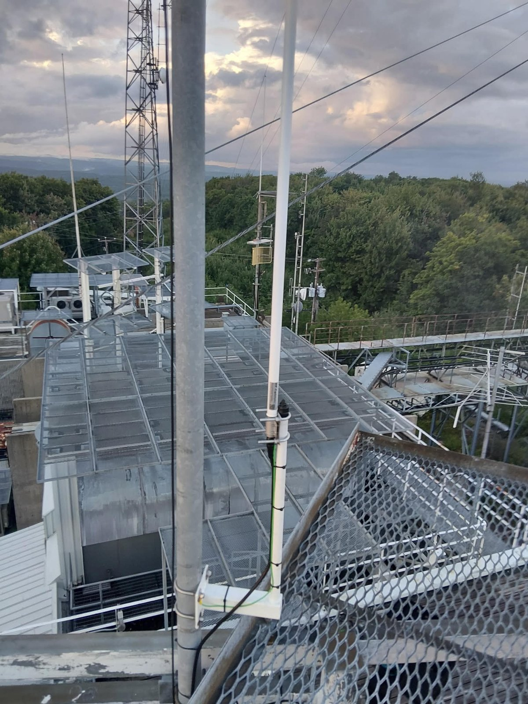{ width="300" }
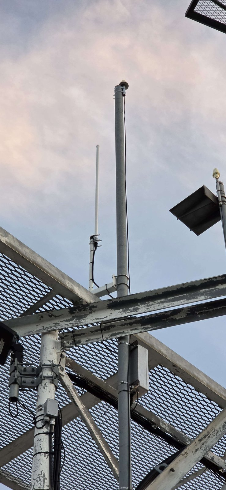{ width="300" }
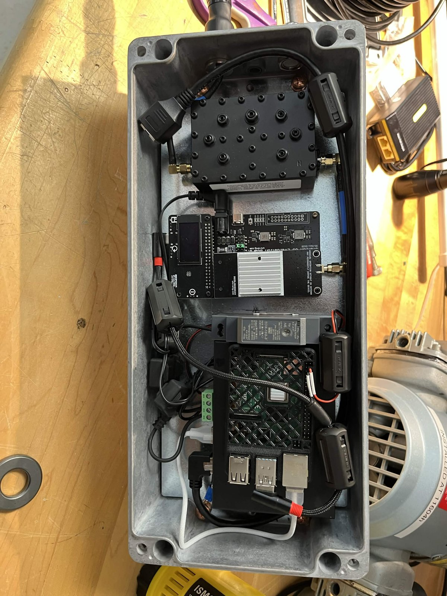{ width="300" }
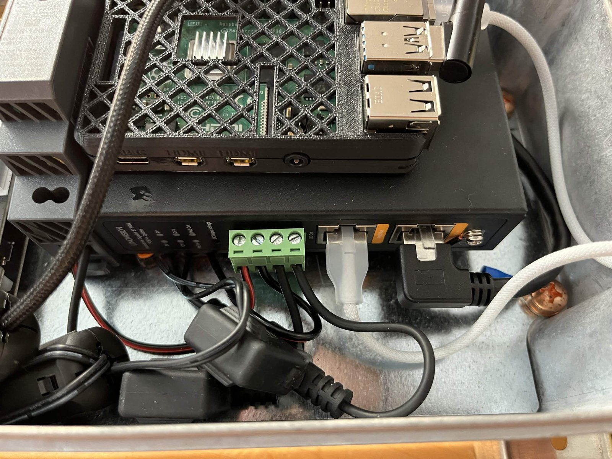{ width="300" }
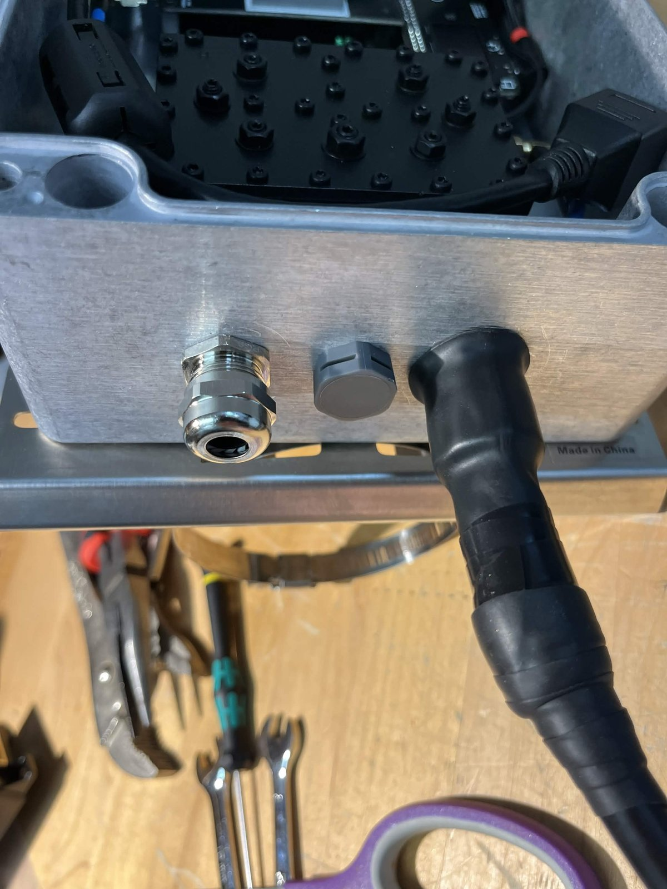{ width="300" }

---

## Hull_Hospital  

**Location:** Hull  
**Type:** PoE-powered high-elevation repeater  
**Role:** Cross-river Backbone Repeater  
**Antenna:** Seeed Studio 902–928 MHz 8 dBi  
**Height:** ~110 m AGL  

**Notes:**  

- Covers much of Hull and most of Ottawa  
- 1 W Ikoka behind an Airframes filter, PoE powered  
- A Raspberry Pi in the enclosure handles remote management over Tailscale, backed by LTE  
- The Pi also carries lightning, vibration and environmental sensors along with an INA current monitor  

*Photos:*  

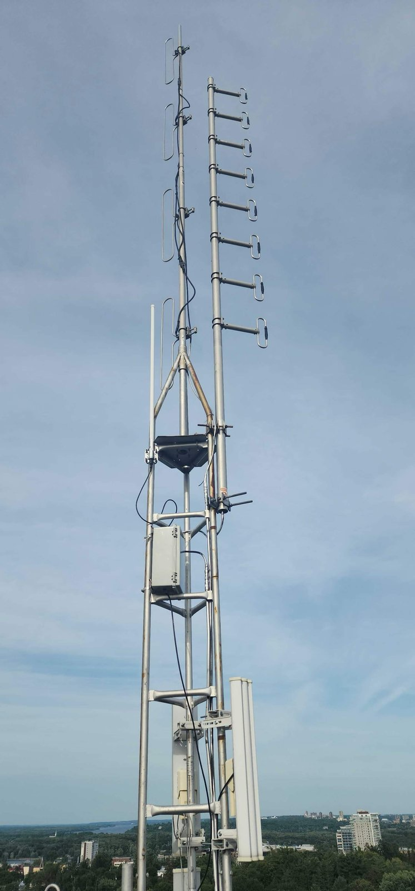{ width="300" }
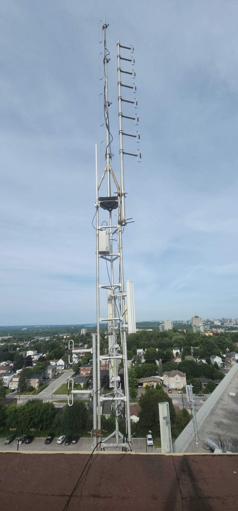{ width="300" }
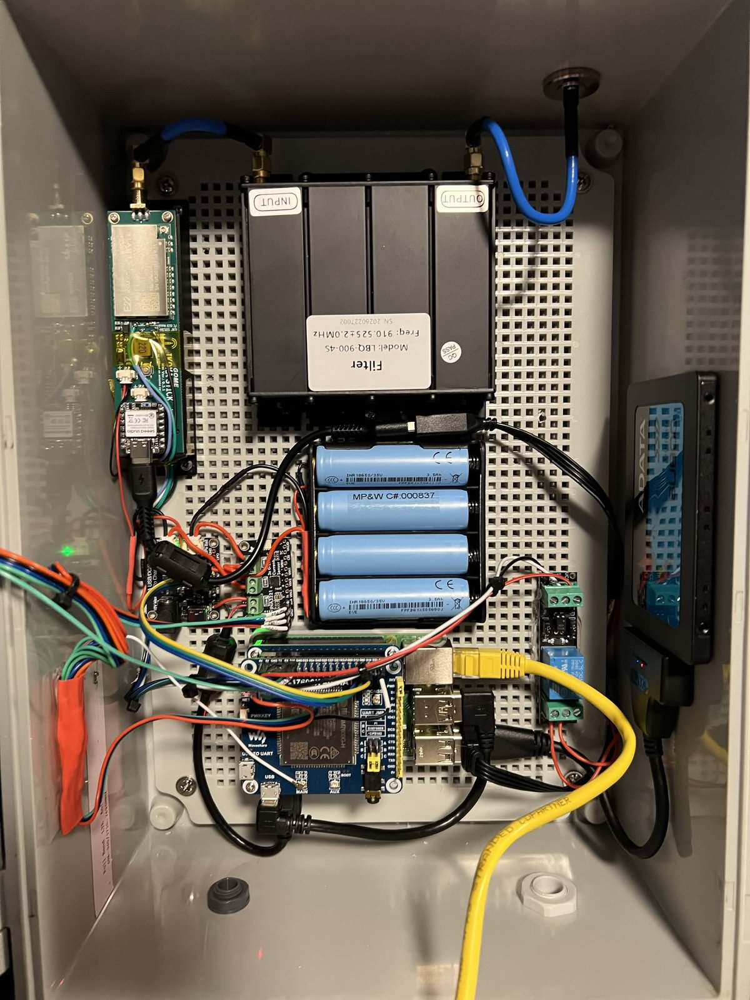{ width="300" }

---

## OARC_R1  

**Location:** Kanata  
**Type:** Solar-powered rooftop repeater  
**Role:** West-end Regional Repeater  
**Antenna:** Seeed Studio 902–928 MHz 8 dBi  
**Height:** ~20 m AGL  

**Notes:**  

- Covers much of the west end  
- OARC helped secure the condo rooftop location for the install  
- 1 W Ikoka behind an Airframes filter, running on solar  

*Photos:*  

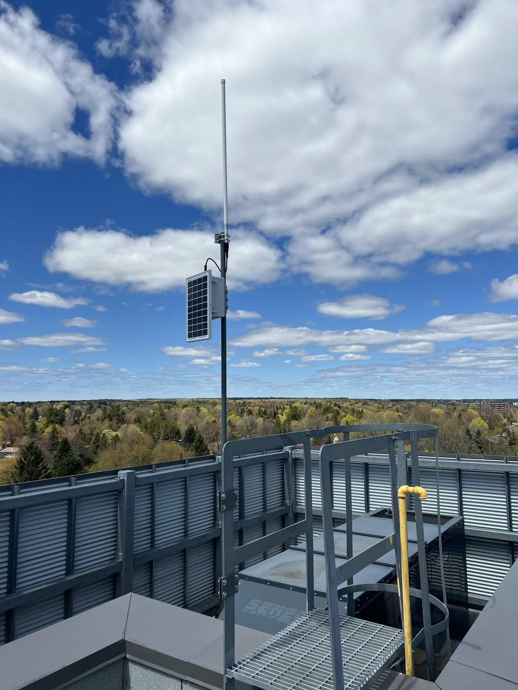{ width="300" }
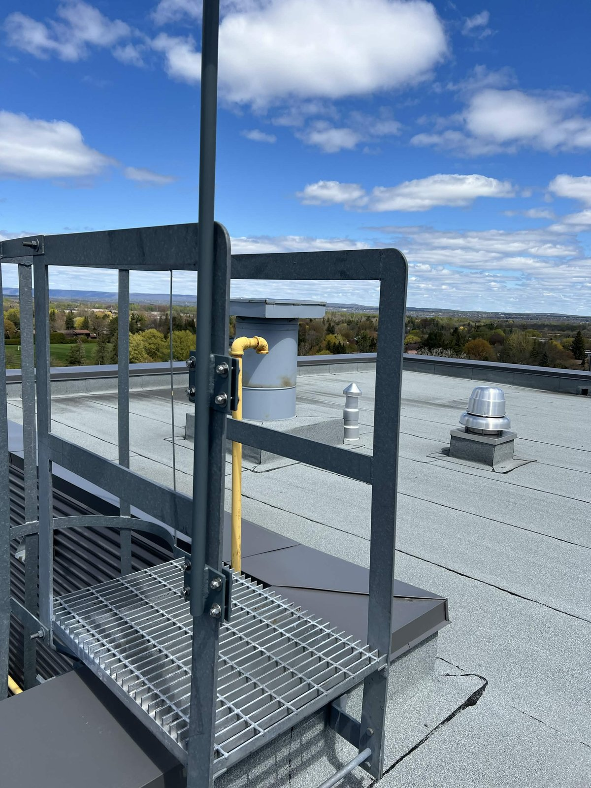{ width="300" }

---

## MAY_SOLAR_R  

**Location:** Old Ottawa South  
**Type:** Solar-powered repeater  
**Role:** Old Ottawa South Community Repeater  
**Antenna:** Alfa 5.8 dBi  
**Height:** ~15 m  

**Notes:**  

- Serves Old Ottawa South, Carleton University, Riverside, and parts of downtown  
- One of the earliest long-term solar installs in Ottawa  
- Mounted on the roof of the historic Mayfair Theatre  

*Photos:*

<table>
  <tr>
    <td>
      
    </td>
    <td>
      
    </td>
  </tr>
</table>

---

## TOO_SOLAR_R  

**Location:** Ashton  
**Type:** Solar-powered high-elevation repeater  
**Role:** Western Regional Repeater  
**Antenna:** Seeed Studio RF Explorer 902–928 MHz 8 dBi (1300 mm)  
**Height:** ~31 m  

**Notes:**  

- Extends the mesh into Ashton, Beckwith, Munster, Kemptville, Carleton Place, and nearby rural areas  
- Provides exceptional long-range coverage due to elevation and antenna gain

*Photos:*  

{ width="300" }
{ width="300" }

---

## CAN_SOLAR_R  

**Location:** Valley View Grain Silo  
**Type:** Solar-powered high-elevation repeater  
**Role:** Western Backbone Repeater  
**Antenna:** Alfa Omni 5.8 dBi  
**Height:** ~45 m  

**Notes:**  

- One of the most far-reaching repeaters in the region  
- Provides interlinks to Stittsville, Richmond, Barrhaven, Orleans, Kanata, and much of the city  
- Among the highest repeater installations in Ottawa  

*Photos:*

<table>
  <tr>
    <td></td>
    <td></td>
  </tr>
</table>

---

## phr5  

**Location:** Kemptville region  
**Type:** Solar-powered elevated home-mounted repeater  
**Role:** Southern Regional Repeater  
**Antenna:** TBD  
**Height:** ~18 m  

*Photo:*  
{ height="200" }

**Notes:**

- Extends mesh coverage south from Barrhaven into rural Kemptville  
- Plays a key role in bridging Ottawa’s southern and rural networks  

---

## e7her.nod3  

**Location:** Katimavik  
**Type:** Solar-powered elevated tree-mounted repeater  
**Role:** Kanata Regional Repeater  
**Antenna:** Alfa 5.8 dBi  
**Height:** ~15 m  

**Notes:**  

- Connects to CAN and TOO while strengthening Kanata and Stittsville coverage  
- Often acts as a relay point for new west-end installs
- [Installation Walkthrough](https://github.com/n1x1um/decentralized-wireless/blob/main/mounts/tree-one/README.md)

*Photo:*  
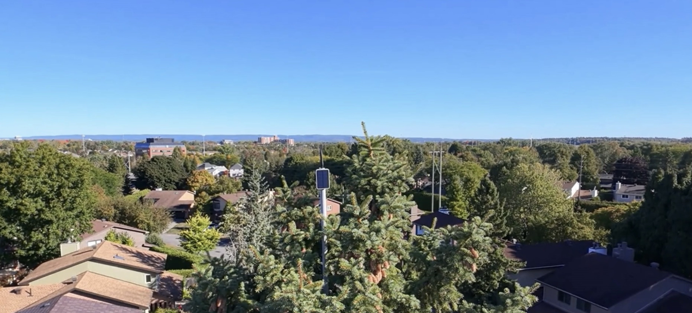{ height="200" }

---

## GD-MrA_R3  

**Location:** Kanata  
**Type:** Solar-powered elevated home-mounted repeater  
**Role:** Kanata Community Repeater  
**Antenna:** Alfa 5.8 dBi  
**Height:** ~14 m  

**Notes:**  

- Links into CAN and TOO, providing strong regional coverage  
- Serves as a backbone connection between high-elevation western repeaters and central Ottawa

*Photo:*  
{ width="300" }

---

## Alx (AlxR1 / AlxR2 / AlxR4)  

**Location:** Orleans / Gloucester  
**Type:** Mix of directional and omni installations  
**Role:** East-end Backbone Repeaters  

*Photos:*  
<!-- -   -->
<!-- -   -->
<!-- -   -->

**Notes:**  

- One of the strongest and most stable backbone clusters in the east end  
- AlxR2’s elevation provides excellent links across the city  
- Critical for maintaining resilience and coverage throughout Orleans  

---

## NEW_SOLAR_R / VA3TEC_R1  

**Location:** Orleans  
**Type:** Solar-powered elevated home-mounted repeater  
**Role:** East-end Regional Repeater  
**Antenna:** Alfa 5.8 dBi  
**Height:** ~12 m  

**Notes:**  

- Links to the Alx cluster while providing coverage into Orleans, Buckingham, and nearby regions  
- Common relay point for new east-end installs  

*Photos:*  

{ width="300" }
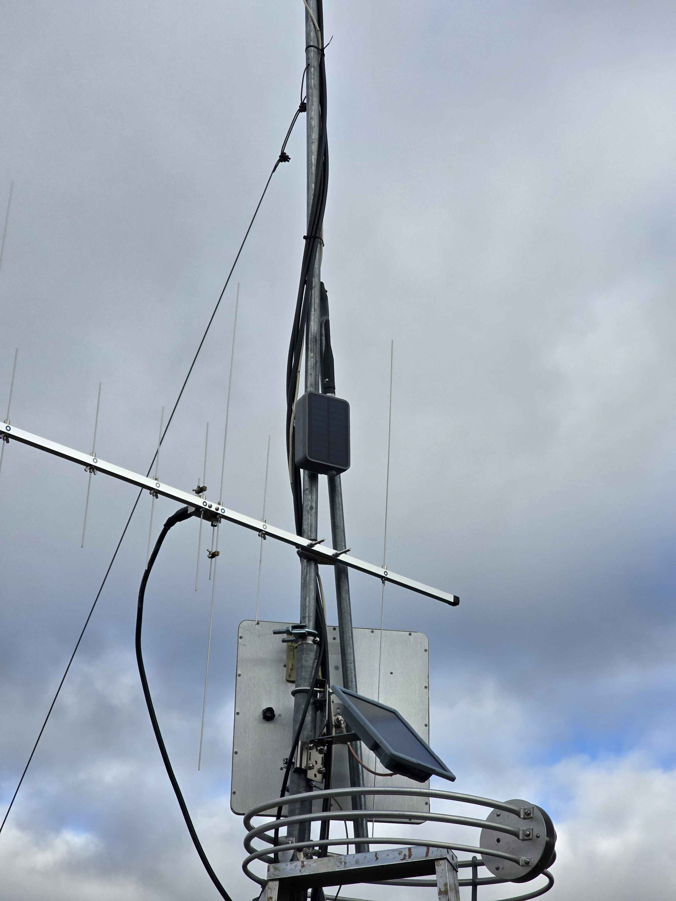{ width="300" }
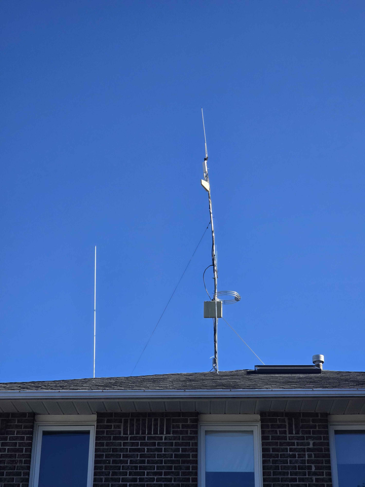{ width="300" }
{ width="300" }

---

## More Installations Coming Soon

This showcase will continue to grow as new backbone repeaters come online and as additional photos and technical writeups are supplied.

If you'd like to feature your repeater or spot something that should be updated, contact **MrAlders0n** or one of the **Knowledge Curators** on Discord.
