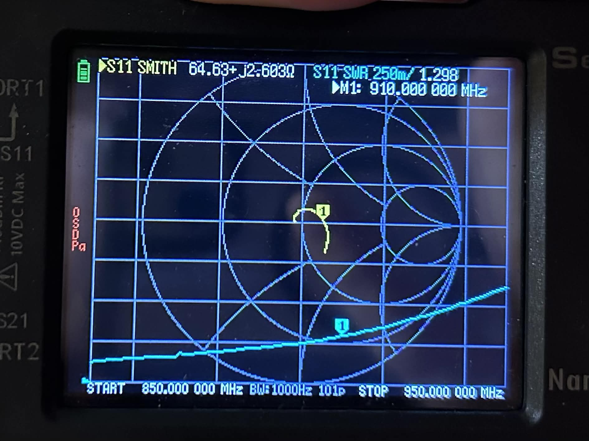
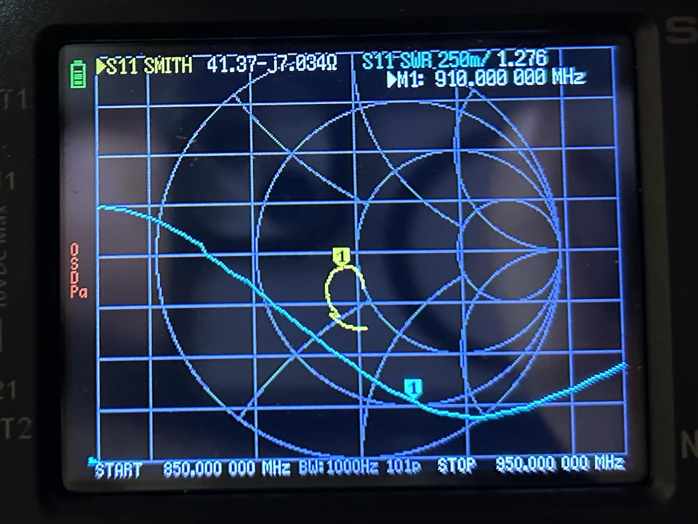
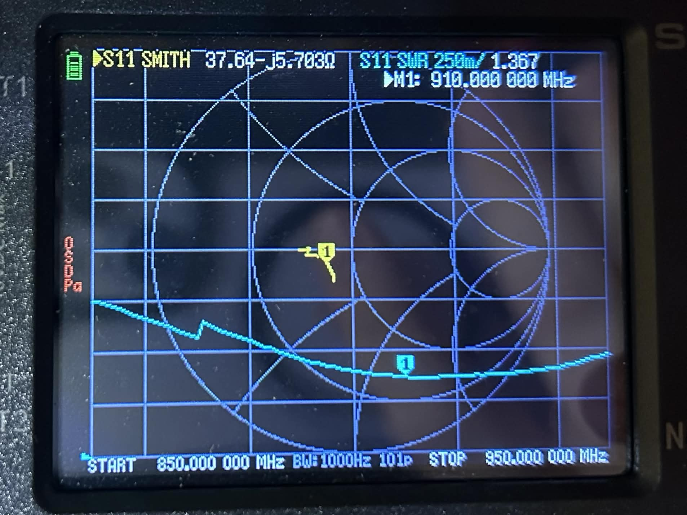

# Antenna Testing

Here are some antennas tested by one of our community members, **Brianna (VA3QWQ)**.

For reference, these are the ideal values for antennas:

SWR: 1.0
Impedance match: 50 ohms
Reactance: 0 ohms

With reactance at 0 ohm an antenna would be purely resistive which is ideal. A positive value means that the antenna has some inductance at that frequency, and a negative value means the antenna has some capacitance.

All tests were performed at 910 MHz, since that is the frequency our mesh uses.

## Rokland 4dBi Helium Hotspot Fiberglass

**Link**: [Rokland](https://store.rokland.com/products/4-dbi-helium-hotspot-fiberglass-outdoor-antenna-bracket-mount-for-rak-bobcat-nebra-sensecap)
**SWR**: 1.29
**Impedance**: 64.6 ohms
**Reactance (j-value)** : +2.6 ohms

*NanoVNA:*  
{ height="200" }

## Slinkdsco Long-Range LORA Antenna (915 MHz Grey)

**Link**: [AliExpress](https://a.aliexpress.com/_mMRiO8F)
**SWR**: 1.27
**Impedance**: 41.3 ohms
**Reactance (j-value)** : +7.0 ohms

*NanoVNA:*  
{ height="200" }

## GizONT 915Mhz antenna

**Link**: [Space Hedgehog](https://space-hedgehog.com/products/gizont-915mhz-antenna)
**SWR**: 1.36
**Impedance**: 37.6 ohms
**Reactance (j-value)** : -5.7 ohms

*NanoVNA*  
{ height="200" }

## Slinkdsco Waterproof 5.8dBi Meshtastic Lora 915MHz Fiberglass Antenna

**Link**: [Amazon](https://www.amazon.ca/dp/B09N2H166D)
**SWR**: 1.18
**Impedance**: 45.8 ohms
**Reactance (j-value)** : +6.7 ohms

*NanoVNA:*  
{ height="200" }