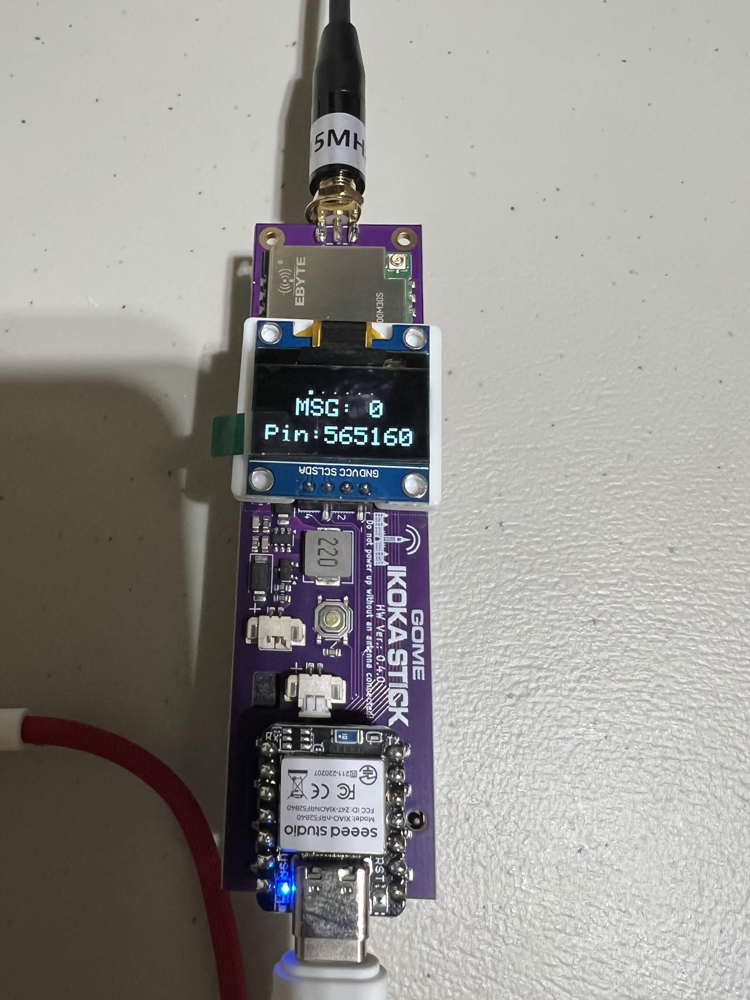

# Ikoka Stick – 1W Community Build

Our community occasionaly orders a batch of Ikoka Stick nodes built for the Ottawa MeshCore community. Check out the Discord to see when the latest batch is being ordered.

This design is based on the [Ikoka Stick project](https://ndoo.sg/projects:amateur_radio:meshtastic:diy_devices:ikoka_stick).

The latest batch uses the Ebyte E22P-915M30S 1 W LoRa module paired with the Seeed Studio XIAO nRF52840. It can be used in Companion and Repeater builds.

{ width="300" }

## Highlights

- Output Power: Up to 1 W (30 dBm) with adjustable TX levels
- Compact Design: Stick-style enclosure, pocket-sized and easy to mount
- MCU: Seeed Studio XIAO nRF52840
- Radio Module: E22P-915M30S
- Firmware Support: MeshCore, Meshtastic

## E22P-900M30S Radio Specs

- Frequency Range: 902-928 MHz
- Max TX Power: 30 dBm (1 W)
- RX Sensitivity: down to –149 dBm
- Modulation: LoRa / FSK

## Power & I/O

- USB-C for programming & power
- Onboard 21700 cell holder (Li-ion/LiPo) with charging support
- GPIO breakout for expansion

## Notes

- Always use the Ikoka Stick 30dBm firmware, if you flash the 33dBm firmware you risk damaging the radio
- Set your TX power to 19 dBm
- The firmware defaults to 20 dBm, but testing has shown distortion at full 20 dBm, backing off by 1 dB cleans things up with no meaningful range loss
- While the Ikoka is a 1W / 30 dBm radio, that extra boost comes from the LNA
- The built in USB charger is slow and has a safety timer that terminates charging after 7-10 hours, requiring a power cycle
- It is recommended to charge batteries with an external charger and hot swap batteries if using the Ikoka Stick as a companion
