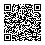

# Public Channels Directory
MeshCore hashtag channels are topic-based groups that start with a "#" symbol, allowing users to join and communicate on specific subjects. These channels are not encrypted, so anyone can read the messages. You can join them by entering the channel name or scanning a QR code in the MeshCore app.

| Channel | Description | Public Key | QR Code |
|---------|-------------|------------|---------|
| `#ottawa` | General discussion on the Ottawa mesh | 7871ec72b45617696c35c970bddd8124 |  |